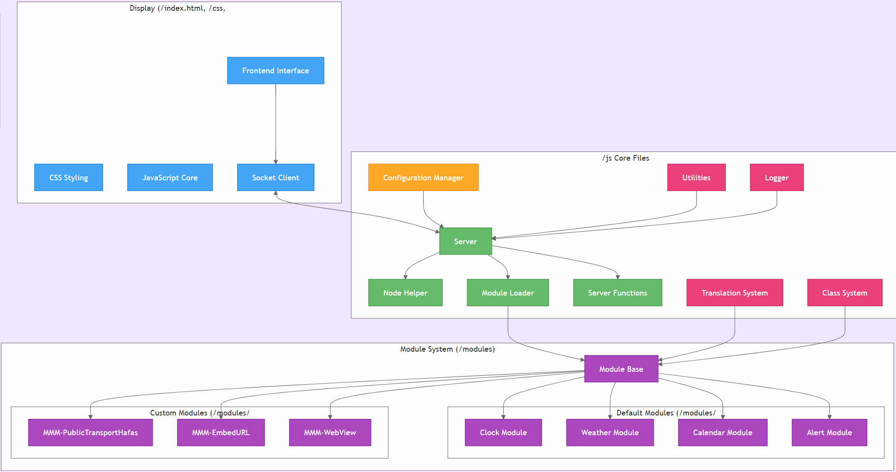

# Azubi Reflektor

Der magische Spiegel, der nicht nur dein Aussehen reflektiert, sondern auch deine Lernkurve – und ja, er zeigt dir auch, ob du bereit für die nächste Kaffeepause bist!

## Installation

Dieses Github Repo wird durch einen Skript auf dem Raspi automatisch bei einem Start gepullt und deployed (main branch).

Dieses liegt lokal auf dem Raspi als auch im [AzubiReflektorSkripts](https://github.com/davinci05/AzubiReflektorScripts) Repository

## Magic Mirror Struktur

## Konfiguration

Die Konfiguration erfolgt über die `config.js` Datei im Hauptverzeichnis.

### Module

Die Module befinden sich im `modules` Verzeichnis. Jedes Modul hat seinen eigenen Ordner. Zum Beispiel:

- `modules/default/clock`
- `modules/default/compliments`
- `modules/MMM-PublicTransportHafas`
Jedes Modul hat eine eigene `config` Option, die spezifische Einstellungen für das Modul enthält.
